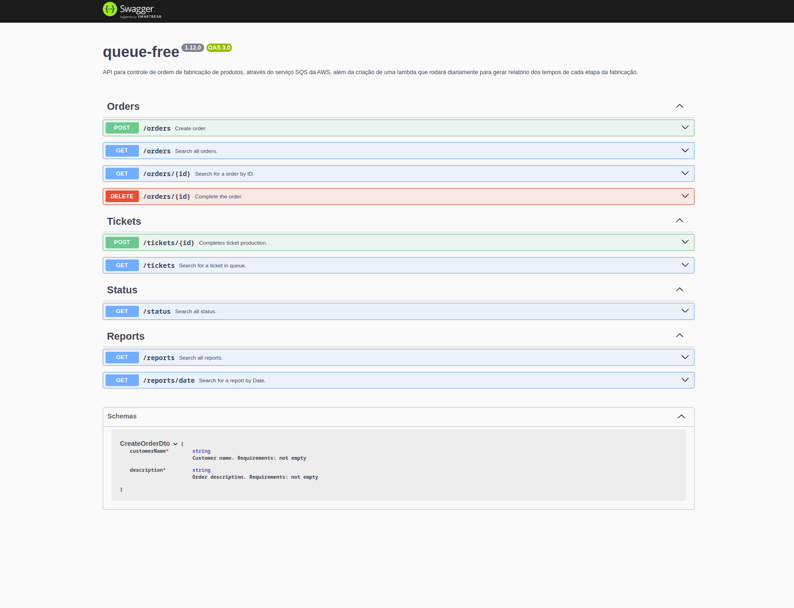
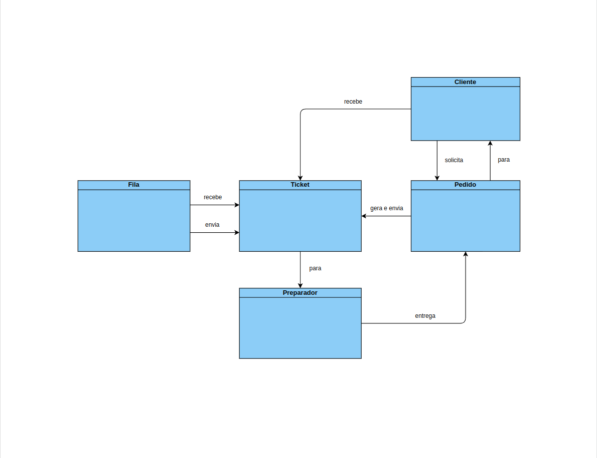
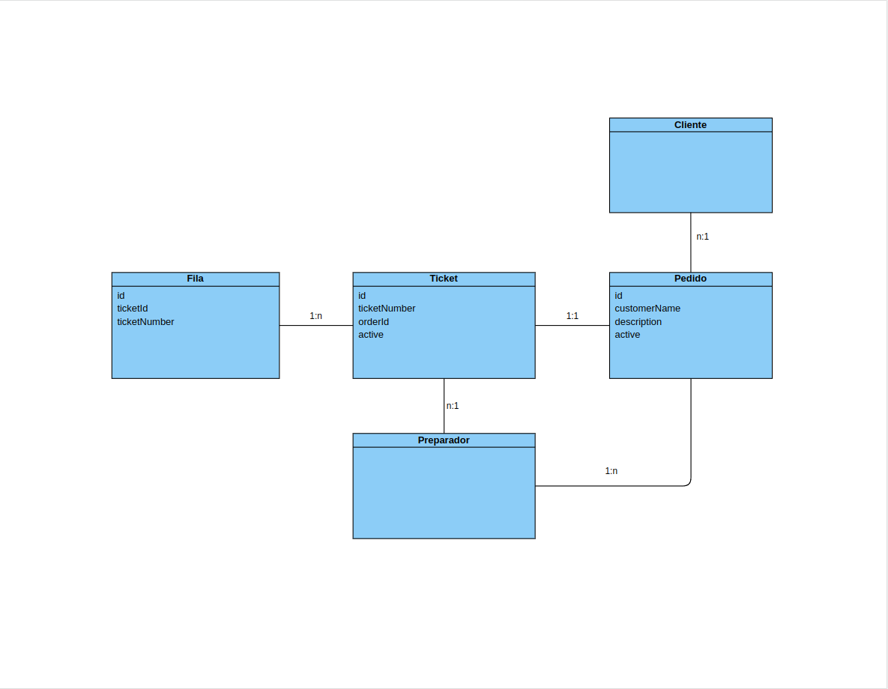

# Queue-free

  

Projeto criado para colocar em prática os conhecimentos adquiridos ao longo dos últimos 06 (seis) meses, atendendo ao PDI Seedz (Integração - Segundo Semestre - 2023).

Objetivos do PDI:

- Escolhe um Tema e desenvolver a Documentação de uma Aplicação (Arquitetura) utilizando no mínimo 4 tecnologias diferentes (Exemplo: API, DB, FILA, SERVERLESS, CACHE).
- Implementar código da aplicação baseada na documentação gerada.

Sobre o Projeto: Desenvolvi uma API para controle de ordem de fabricação de produtos, através do serviço SQS da AWS, além da criação de uma lambda que rodará diariamente para gerar relatório dos tempos de cada etapa da fabricação.

---

# Sumário

- [Licença](#licença)
- [Tecnologias utilizadas](#tecnologias-utilizadas)
- [Estrutura do Projeto](#estrutura-do-projeto)
- [Swagger](#swagger)
- [Diagrama de Domínio](#diagrama-de-domínio)
- [Diagrama de Entidade](#diagrama-de-entidade)
- [Diagramas de Sequência](#diagramas-de-sequência)
  - [Orders Create](#orders-create)
  - [Orders Find All](#orders-find-all)
  - [Orders Find One](#orders-find-one)
  - [Orders Complete](#orders-complete)
  - [Tickets Receive Message](#tickets-receive-message)
  - [Tickets Production Complete](#tickets-production-complete)
  - [Status Find All](#status-find-all)
  - [Reports Find All / Find by Date](#reports-find-all-/-find-by-date)
- [Pré-requisitos](#pré-requisitos)
  - [Ferramentas necessárias](#ferramentas-necessárias)
  - [Rodando no servidor local](#rodando-local)
  - [Swagger do Projeto](#swagger-do-projeto)
- [Quer contribuir com o projeto?](#quer-contribuir-com-o-projeto)
- [Contribuição](#contribuição)
- [Agradecimentos](#agradecimentos)
- [Autor](#autor)

---

# Licença

Este projeto esta sobe a licença [MIT](https://pt.wikipedia.org/wiki/Licen%C3%A7a_MIT).

---

# Tecnologias utilizadas

### Nodejs

O Node.js é um ambiente de execução do código JavaScript do lado do servidor (back-end).

Quer saber mais? [AQUI](https://nodejs.org/en/about)

### Typescript

O TypeScript adiciona sintaxe adicional ao JavaScript para oferecer suporte a uma integração mais estreita com seu editor.
Detecte erros mais cedo em seu editor.

Quer saber mais? [AQUI](https://www.typescriptlang.org/pt/)

### Nestjs

O NestJS é um framework Node.js de código aberto destinado ao desenvolvimento de aplicativos do lado do servidor.

Quer saber mais? [AQUI](https://nextjs.org/)

### Docker

O Docker é utilizado para implantar aplicativos dentro de containers virtuais, permitindo que vários aplicativos funcionem em diferentes ambientes complexos.

Quer saber mais? [AQUI](https://www.docker.com/)

### Docker Compose

O docker compose é o orquestrador de containers Docker, definindo e executando aplicativos Docker com vários contêineres.

Quer saber mais? [AQUI](https://docs.docker.com/compose/)

### ESLint

O ESLint é um linter, uma ferramenta de análise estática, para as linguagens Javascript e Typescript.

Quer saber mais? [AQUI](https://eslint.org/)

### Prettier

O Prettier é um formatador de código opinativo que impõe um estilo consistente analisando seu código.

Quer saber mais? [AQUI](https://prettier.io/)

### Mongodb

O MongoDB é um software de banco de dados orientado a documentos livre, de código aberto e multiplataforma.

Quer saber mais? [AQUI](https://www.mongodb.com/pt-br)

### Mongoose

O Mongoose é uma biblioteca de programação orientada a objetos JavaScript que cria uma conexão entre o MongoDB e o ambiente de tempo de execução JavaScript Node.js

Quer saber mais? [AQUI](https://mongoosejs.com/)

### Semantic-release

O semantic-release automatiza todo o fluxo de trabalho de lançamento do pacote, incluindo: determinar o próximo número de versão, gerar as notas de lançamento e publicar o pacote.

Quer saber mais? [AQUI](https://github.com/semantic-release/semantic-release)

Eu tenho um repositório que auxilia de forma prática a instalação e execução da ferramenta. Bora acessar? ;) [AQUI](https://github.com/WanderDinizVeloso/conventional-commit-and-auto-version)

### Conventionalcommits

O Conventional Commits define um conjunto de regras para criar um histórico de commit explícito.

Quer saber mais? [AQUI](https://www.conventionalcommits.org/pt-br/v1.0.0/)

### Commitlint

O Commitlist é uma ferramenta que verifica se suas mensagens de commit atendem ao formato do Conventional Commits.

Quer saber mais? [AQUI](https://github.com/conventional-changelog/commitlint)

Eu tenho um repositório que auxilia de forma prática a instalação e execução da ferramenta. Bora acessar? ;) [AQUI](https://github.com/WanderDinizVeloso/conventional-commit-and-auto-version)

### Husky

O husky é uma ferramenta que executa scripts personalizados no seu repositório.

Quer saber mais? [AQUI](https://typicode.github.io/husky/)

Eu tenho um repositório que auxilia de forma prática a instalação e execução da ferramenta. Bora acessar? ;) [AQUI](https://github.com/WanderDinizVeloso/conventional-commit-and-auto-version)

### Localstack

O Localstack emula serviços em da AWS localmente.

Quer saber mais? [AQUI](https://www.localstack.cloud/)

### Serverless/serverless-localstack

O serverless é uma ferramenta de linha de command (CLI) que auxilia no desenvolvimento de AWS lambdas.

Quer saber mais? [AQUI](https://www.npmjs.com/package/serverless)

### AWS SQS

O Amazon Simple Queue Service (SQS) é um serviço de gerenciamento de filas em nuvem.

Quer saber mais? [AQUI](https://aws.amazon.com/pt/sqs/)

### AWS lambda

O AWS Lambda é um serviço orientado a eventos que permite executar códigos sem servidor

Quer saber mais? [AQUI](https://aws.amazon.com/pt/lambda/)

### Swagger

Ferramenta que facilita a documentação de API's.

Quer saber mais? [AQUI](https://swagger.io/)

---

# Estrutura do Projeto

O projeto está estruturado da seguinte maneira:

```bash
├── app.module.ts
├── aws
│   ├── aws-config.ts
│   ├── aws.module.ts
│   └── sqs.service.ts
├── interceptors
│   ├── interface
│   │   ├── common-interceptors.interface.ts
│   │   └── invalid-id.interface.ts
│   └── invalid-id.interceptor.ts
├── lambdas
│   └── report.js
├── main.ts
├── orders
│   ├── dto
│   │   ├── create-order.dto.ts
│   │   └── update-order.dto.ts
│   ├── interface
│   │   └── order.interface.ts
│   ├── orders.controller.ts
│   ├── orders.module.ts
│   ├── orders.service.ts
│   └── schema
│       └── order.schema.ts
├── reports
│   ├── reports.controller.ts
│   ├── reports.module.ts
│   ├── reports.service.ts
│   └── schema
│       └── report.schema.ts
├── status
│   ├── interface
│   │   └── status.interface.ts
│   ├── schema
│   │   └── status.schema.ts
│   ├── status.controller.ts
│   ├── status.module.ts
│   └── status.service.ts
├── tickets
│   ├── interface
│   │   └── ticket.interface.ts
│   ├── schema
│   │   └── ticket.schema.ts
│   ├── tickets.controller.ts
│   ├── tickets.module.ts
│   └── tickets.service.ts
└── utils
    ├── messages-response.ts
    └── redis-times.ts

```

---

# Swagger

Após iniciar o projeto, seguindo os passos ([AQUI](#rodando-local)), o swagger do projeto estará disponível no [localhost:3001](http//localhost:3001).



---

# Diagrama de Domínio



---

# Diagrama de Entidade



---

# Diagramas de Sequência

## Orders Create


## Orders Find All


## Orders Find One


## Orders Complete


## Tickets Receive Message


## Tickets Production Complete


## Status Find All


## Reports Find All / Find by Date


---

# Pré-requisitos

## Ferramentas necessárias

Para rodar o projeto, você vai precisar instalar as seguintes ferramentas:

- [Git](https://git-scm.com);
- [Node.js](https://nodejs.org/en/) - versão 18.17.0;
- [Docker](https://www.docker.com/) - versão mínima 20.10.24;
- [Docker Compose](https://docs.docker.com/compose/) - versão mínima 2.17.2;
- Um editor para trabalhar com o código como [VSCode](https://code.visualstudio.com/) ou outro de sua preferência;

## Rodando local

- Clone do Projeto e instale as dependências

  ```bash
  # Clone este repositório
    # via SSH
  $ git clone git@github.com:WanderDinizVeloso/queue-free.git

  # Acesse a pasta do projeto clonado
  $ cd queue-free

  # Instale as dependências
  $ npm install
  ```

- Bora iniciar?:

  ```bash
  # Inicie o sistema e suba os contêineres do docker
  $ npm run start:dev
    obs.: O comando inicia o sistema e sobe os contêineres

  # Acesse o swagger
  http://localhost:3001

  # Efetue o deploy da Lambda
  $ npm run lambda:deploy

  # Execute a lambda
  $ npm run lambda:invoke

  ```

## Quer contribuir com o projeto?

- Crie uma branch e faça sua contribuição:

  ```bash
  # Crie uma branch a partir da branch main
  $ git checkout -b nome-da-nova-branch

  # Adicione as mudanças desejadas com os devidos commits
  $ git add . # adiciona as mudanças ao stage do Git
  $ git commit -m 'typeDoCommit:informação do conteúdo do commit' # salvando as alterações de cada pequena alteração em um commit
  $ git push -u origin nome-da-nova-branch # adiciona a nova branch no repositório remoto do Projeto
  ```

- Crie um novo `Pull Request` (PR):
  - Vá até a página de `Pull Requests` do repositório no GitHub
  - Clique no botão verde `"New pull request"`
  - Clique na caixa de seleção `"Compare"` e escolha a sua branch com atenção
  - Clique no botão verde `"Create pull request"`
  - Adicione uma descrição para o Pull Request
  - Clique no botão verde `"Create pull request"`
  - Me marque para revisar. `:)` [Wander](https://github.com/wanderdinizveloso)

---

# Contribuição

Bora entrar para esta lista? `;)` [AQUI](#pré-requisitos)

---

# Autor

 
 <br />
  Wander Diniz Veloso
<br />
  Desenvolvedor Back-End

<section> 
  <a href="https://www.linkedin.com/in/wander-diniz-veloso" target="_blank"></a>
</section>

---
